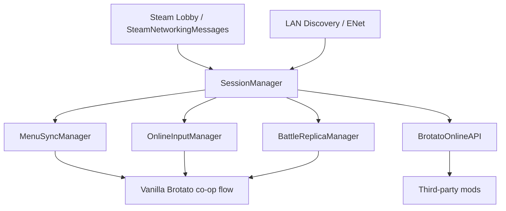

# Brotato Online

[简体中文](README.md) | **English**

> Remote and LAN multiplayer support for *Brotato*, using a host-led hybrid synchronization model.


Brotato Online is a mod that adds multiplayer support to *Brotato*. It currently supports Steam friend lobbies, Steam public lobbies, and LAN sessions while synchronizing the main flow from character and weapon selection through combat, upgrades, shops, and continued runs.

The goal is not to replace Brotato's original co-op flow with a completely different multiplayer mode. Instead, the project tries to preserve the vanilla co-op experience and mod compatibility while allowing players on different machines to share the same run.

## Usage

### Steam

1. Install and enable Brotato Online for every player.
2. The host creates a lobby in-game.
3. Invite friends through Steam or make the lobby public.
4. Clients join through the Steam invite or the in-game lobby browser.
5. Once everyone is in the same session, use the normal co-op character, weapon, and run flow.

### LAN

LAN sessions can be used directly without Steam lobby discovery.

- Prefer automatic LAN discovery in the lobby browser.
- If broadcast discovery is unavailable, use **Direct Connect (LAN)** with the host IP and port.
- The default game port is `27462`; LAN discovery uses `27463`.

> Steam public lobbies and discovered LAN rooms appear in the same lobby browser.

## Features

### Sessions and lobbies

- Up to 4 players
- Steam friend lobbies and friend invitations
- Steam public lobby browser
- Public lobby host, player count, phase, and latency display
- View the host's loaded mod list before joining
- Automatic LAN lobby discovery
- Manual LAN connection by IP and port
- Shared session logic across Steam and LAN transports
- Clear errors for version/protocol mismatch, full rooms, stale lobbies, and other join failures

### Game-flow synchronization

- Character and weapon selection
- Difficulty, zone, and run configuration
- Game start and scene transitions
- Wave progression and important combat state
- Player HP, death, and failed-wave flow
- Upgrades, item boxes, and shop progression
- Ready/cancel-ready and other online menu actions
- Continuing vanilla co-op saves
- Reserved in-run slots and reconnect flow for continued runs

### Combat synchronization

Brotato Online is not a fully host-authoritative simulation. Different kinds of state use different synchronization strategies. The Host leads shared progression and critical state, while Clients still simulate substantial parts of the game locally so Brotato's original logic can be reused without replicating everything at high frequency.

### Multiplayer UX

- Quick-chat wheel
- Custom quick-chat phrases, up to 20 characters each
- Option to disable custom quick chat and accept only built-in phrases
- Selectable local multiplayer input device
- Keyboard/mouse and gamepad support
- Optional outline for locally controlled characters
- Safe return to the main menu when the host disconnects unexpectedly
- Chinese and English UI text

## Installation

### Steam Workshop

If you use the Workshop build, subscribe to Brotato Online and enable it in ModLoader.

### Manual/development build

Install the project as a ModLoader-compatible Godot mod and keep the expected mod directory name:

```text
six666-BrotatoOnline
```

Current compatibility:

| Component                       | Version    |
| ------------------------------- | ---------- |
| Brotato                         | `1.1.15.4` |
| ModLoader                       | `6.2.0`    |
| Brotato Online network protocol | `4.0.0`    |
| Maximum players                 | `4`        |

## Network Architecture



The central rule is simple: **SessionManager owns session state, Host/Client roles, and message routing; Steam/LAN only provide transport; menu, input, and combat each use synchronization suited to their own state.**

This keeps gameplay logic independent from a single networking backend and allows combat synchronization to evolve without rewriting lobby/session handling.

## Main Modules

```text
six666-BrotatoOnline/
├─ manifest.json
├─ mod_main.gd
├─ scripts/
│  ├─ session_manager.gd
│  ├─ steam_transport.gd
│  ├─ lan_transport.gd
│  ├─ lan_discovery.gd
│  ├─ public_lobby_browser.gd
│  ├─ menu_sync_manager.gd
│  ├─ online_player_slot_manager.gd
│  ├─ online_input_manager.gd
│  ├─ battle_replica_manager.gd
│  ├─ state_snapshot.gd
│  ├─ upgrade_runtime_sync.gd
│  ├─ online_mod_settings_manager.gd
│  ├─ quick_chat_wheel.gd
│  ├─ brotato_online_api.gd
│  └─ ...
├─ extensions/
│  └─ ...
├─ docs/
│  ├─ API.md
│  └─ API.en.md
└─ translations/
   ├─ brotato_online_zh.txt
   └─ brotato_online_en.txt
```

| Module                           | Role                                                                                         |
| -------------------------------- | -------------------------------------------------------------------------------------------- |
| `session_manager.gd`             | Session ownership, host/client roles, connections, disconnect/reconnect, and message routing |
| `steam_transport.gd`             | Steam lobby callbacks and SteamNetworkingMessages transport                                  |
| `lan_transport.gd`               | LAN/ENet connections and data transport                                                      |
| `lan_discovery.gd`               | LAN lobby broadcast discovery                                                                |
| `public_lobby_browser.gd`        | Steam public lobbies, LAN rooms, latency probing, and host mod information                   |
| `menu_sync_manager.gd`           | Character, weapon, upgrade, shop, and other menu-phase synchronization                       |
| `online_player_slot_manager.gd`  | Player slots, remote placeholders, and input-device mapping                                  |
| `online_input_manager.gd`        | Client input capture and host-side input application                                         |
| `battle_replica_manager.gd`      | Client combat-state application, entity presentation, and battle-end coordination            |
| `state_snapshot.gd`              | Host combat snapshots, important state, and event serialization                              |
| `upgrade_runtime_sync.gd`        | Runtime upgrade-state synchronization                                                        |
| `online_mod_settings_manager.gd` | Input device, player outline, quick-chat, and multiplayer settings                           |
| `brotato_online_api.gd`          | Stable integration API for third-party mods                                                  |

Scripts under `extensions/` handle vanilla edge cases exposed by cross-machine multiplayer, including invalid node access, player-count differences, scene exit, shop interaction, pause-menu focus, and combat cleanup timing.

## Third-party Mod API

Brotato Online exposes a public API so other mods do not need to depend on internal manager nodes.

Full documentation: [`docs/API.en.md`](docs/API.en.md)

### Get the API

```gdscript
var bo_api = null

func _ready():
    var apis = get_tree().get_nodes_in_group("brotato_online_api")
    if apis.size() > 0:
        bo_api = apis[0]
```

### Helper for one-owner gameplay logic in third-party mods

```gdscript
if bo_api == null or bo_api.should_run_authoritative_logic():
    # Offline or host: mutate the real game state
    run_gameplay_logic()
else:
    # Client: local visuals/UI or a request to the host only
    run_client_visual_logic()
```

The API also exposes:

- Online/host/client state
- Current multiplayer phase and context
- Local player indices and ownership checks
- Client-to-host custom messages
- Host broadcast and per-player messages
- Phase, slot-layout, and third-party message events

`should_run_authoritative_logic()` is a safe default helper for third-party mods: if custom logic changes shared game state and must only run once, it should usually run offline or on the Host. The function name does **not** mean that all internal Brotato Online combat simulation is host-authoritative.

Third-party mods should use `BrotatoOnlineAPI` instead of reaching into Brotato Online's internal managers directly.

## Mod Compatibility

Brotato Online tries to preserve vanilla co-op behavior, but online play requires a clear separation between host and client responsibilities.

Mods that are usually easier to support:

- Content mods that only add characters, weapons, or similar data and are installed by all players
- Content additions that do not replace vanilla online menus or critical synchronization flows
- Mods that explicitly integrate through the Brotato Online API

Mods that are more likely to conflict:

- Mods that alter character selection, weapon selection, upgrades, shops, or other UI interactions; button presses, focus, and page state may no longer synchronize correctly between host and clients
- Heavy rewrites of enemies, shops, upgrades, battle-end logic, or scene transitions
- Replacing vanilla co-op player slots or input mapping

Adding new content and replacing an existing flow are very different compatibility cases. A newly added character or weapon can usually reuse Brotato Online's existing selection and synchronization path. A UI mod, however, may replace buttons, focus handling, or page-transition logic and can therefore break synchronized clicks even when it looks purely cosmetic.

The public lobby browser can show the host's mod list before joining, but **matching mod lists do not guarantee compatibility, and different mod lists do not automatically mean the session cannot work**. Compatibility depends on what those mods actually change. 

## Documentation

- [`README.md`](README.md): 中文README
- [`docs/API.md`](docs/API.md): Chinese API documentation
- [`docs/API.en.md`](docs/API.en.md): English API documentation
- [`scripts/brotato_online_api.gd`](scripts/brotato_online_api.gd): API implementation exposed to other mods

## License

This project is licensed under the [GNU General Public License v3.0](LICENSE).
