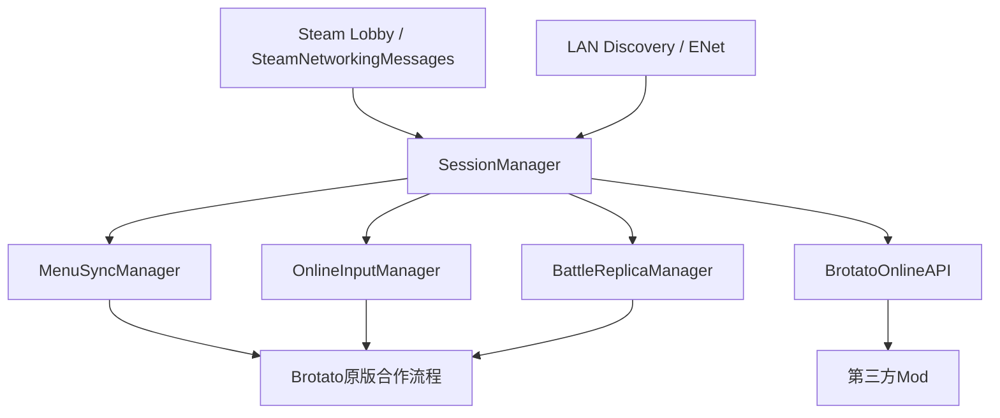

# Brotato Online

**简体中文** | [English](README.en.md)

> 为《Brotato》提供远程联机与局域网联机支持，采用Host主导的混合同步方案。


Brotato Online是一个为《土豆兄弟》添加多人联机支持的Mod。目前支持Steam好友大厅、Steam公共大厅和LAN联机，并同步从角色选择、武器选择、难度选择到战斗、升级、商店和继续游戏的主要流程。

项目目标在尽量保留原版合作流程和Mod兼容性的前提下，让不同机器上的玩家共享同一局游戏。

## 如何使用

### Steam联机

1. 所有玩家安装并启用Brotato Online。
2. 房主在游戏内创建大厅。
3. 通过Steam邀请好友，或将大厅设为公开。
4. Client通过Steam邀请或“加入大厅”进入房间。
5. 所有人进入同一联机会话后，按正常合作模式进行角色、武器和游戏流程选择。

### LAN联机

同一局域网内可以直接使用LAN模式，不依赖Steam大厅发现。

- 优先使用大厅列表中的LAN自动发现房间；
- 如果广播发现不可用，可使用“IP直连（LAN）”输入房主IP和端口；
- 默认游戏端口为`27462`，LAN发现使用`27463`。

> 公共大厅和LAN大厅会显示在同一个大厅浏览界面中。

## 功能

### 联机与大厅

- 最多支持4名玩家联机
- Steam好友大厅与好友邀请
- Steam公共大厅浏览
- 公共大厅显示房主、人数、游戏阶段和延迟
- 加入前查看房主加载的Mod列表
- LAN房间自动发现
- LAN手动IP+端口直连
- Steam与LAN共用同一套游戏会话逻辑
- 协议/版本不兼容、房间已满、房间失效等情况提供明确提示

### 游戏流程同步

- 角色选择与武器选择
- 难度、区域和Run配置
- 游戏开始与场景切换
- 战斗波次与关键战斗状态
- 玩家血量、死亡与失败流程
- 升级选择、物品箱和商店流程
- 准备/取消准备等联机菜单操作
- 原版合作存档继续游戏
- 运行中断线槽位保留与继续游戏重连流程

### 战斗同步

Brotato Online并不是完整的Host权威模拟，而是根据不同状态采用不同同步策略。整体上由Host主导共享流程和关键状态，同时保留Client本地模拟，以尽量复用Brotato原版逻辑并降低同步开销。

### 联机体验

- 快捷聊天轮盘
- 支持自定义快捷用语，单条最多20个字符
- 可禁用自定义快捷用语，只接收原版快捷用语
- 可选择本机联机输入设备
- 支持键鼠和手柄
- 可为本机控制角色添加描边，方便多人战斗时识别
- 主机异常断开时，Client会安全结束当前联机会话并返回主菜单
- 中英文界面文本

## 安装

### Steam创意工坊

如果使用创意工坊版本，订阅Brotato Online并在ModLoader中启用即可。

### 手动安装/开发版本

将项目作为ModLoader可识别的Godot Mod安装，并确保目录名与Mod标识保持一致：

```text
six666-BrotatoOnline
```

当前兼容版本：

| 项目                 | 版本         |
| ------------------ | ---------- |
| Brotato            | `1.1.15.4` |
| ModLoader          | `6.2.0`    |
| Brotato Online网络协议 | `4.0.0`    |
| 最大玩家数              | `4`        |

## 网络架构



核心原则：**SessionManager负责会话、Host/Client角色和消息路由，Steam/LAN只负责传输；菜单、输入和战斗分别采用适合自身状态的同步方式。**

这样可以避免把游戏逻辑绑定到单一网络后端，也方便后续继续调整战斗同步而不影响大厅与连接层。

## 主要模块

```text
six666-BrotatoOnline/
├─ manifest.json
├─ mod_main.gd
├─ scripts/
│  ├─ session_manager.gd
│  ├─ steam_transport.gd
│  ├─ lan_transport.gd
│  ├─ lan_discovery.gd
│  ├─ public_lobby_browser.gd
│  ├─ menu_sync_manager.gd
│  ├─ online_player_slot_manager.gd
│  ├─ online_input_manager.gd
│  ├─ battle_replica_manager.gd
│  ├─ state_snapshot.gd
│  ├─ upgrade_runtime_sync.gd
│  ├─ online_mod_settings_manager.gd
│  ├─ quick_chat_wheel.gd
│  ├─ brotato_online_api.gd
│  └─ ...
├─ extensions/
│  └─ ...
├─ docs/
│  ├─ API.md
│  └─ API.en.md
└─ translations/
   ├─ brotato_online_zh.txt
   └─ brotato_online_en.txt
```

| 模块                               | 作用                                     |
| -------------------------------- | -------------------------------------- |
| `session_manager.gd`             | 统一管理联机会话、Host/Client角色、连接、断线、重连和网络消息路由 |
| `steam_transport.gd`             | Steam大厅回调与SteamNetworkingMessages传输    |
| `lan_transport.gd`               | LAN/ENet连接与数据传输                        |
| `lan_discovery.gd`               | 局域网房间广播发现                              |
| `public_lobby_browser.gd`        | Steam公共大厅、LAN房间、延迟测试和房主Mod信息界面         |
| `menu_sync_manager.gd`           | 角色、武器、升级、商店等菜单阶段同步                     |
| `online_player_slot_manager.gd`  | 玩家槽位、远程玩家占位和输入设备映射                     |
| `online_input_manager.gd`        | Client输入采集与Host侧输入应用                   |
| `battle_replica_manager.gd`      | Client战斗状态应用、实体表现和战斗结束流程协调             |
| `state_snapshot.gd`              | Host战斗快照、关键状态和事件序列化                    |
| `upgrade_runtime_sync.gd`        | 升级运行时状态同步                              |
| `online_mod_settings_manager.gd` | 输入设备、角色描边、快捷用语等联机设置                    |
| `brotato_online_api.gd`          | 面向第三方Mod的稳定联机API                       |

`extensions/`中的脚本用于处理原版逻辑在跨机器联机后出现的边界情况，例如失效节点访问、玩家数量差异、场景退出、商店交互、暂停菜单焦点和战斗清理时序。

## 第三方Mod API

Brotato Online提供公开API，第三方Mod不需要直接依赖内部Manager。

完整文档：[`docs/API.md`](docs/API.md)

### 获取API

```gdscript
var bo_api = null

func _ready():
    var apis = get_tree().get_nodes_in_group("brotato_online_api")
    if apis.size() > 0:
        bo_api = apis[0]
```

### 第三方Mod的权威逻辑辅助判断

```gdscript
if bo_api == null or bo_api.should_run_authoritative_logic():
    # 离线或Host：执行真正改变游戏结果的逻辑
    run_gameplay_logic()
else:
    # Client：只执行本地表现、UI或向Host发送请求
    run_client_visual_logic()
```

API还提供：

- 当前是否联机，以及当前机器是Host还是Client
- 当前联机阶段与上下文
- 本机拥有的玩家索引
- 判断某个玩家是否属于本机
- Client向Host发送自定义消息
- Host广播或向指定玩家发送消息
- 阶段变化、槽位变化和第三方Mod消息事件

`should_run_authoritative_logic()`是给第三方Mod使用的安全默认判断：当某段自定义逻辑只能执行一次并会改变共享游戏状态时，通常应只在离线或Host执行。它并不表示Brotato Online内部所有战斗逻辑都采用Host权威模拟。

第三方Mod应优先通过`BrotatoOnlineAPI`接入，不要直接访问内部Manager节点。

## Mod兼容性

Brotato Online会尽量保留原版合作逻辑，但联机环境下仍需要区分Host与Client的职责。

通常兼容性较好的Mod：

- 仅新增角色、武器等游戏内容，且联机双方都安装了对应Mod
- 不改写原版联机菜单交互或关键同步流程的内容型Mod
- 使用Brotato Online API显式适配联机的Mod

更容易产生冲突的Mod：

- 修改角色选择、武器选择、升级、商店等UI交互的Mod；按钮点击、焦点和页面状态可能无法在Host与Client之间正确同步
- 大幅重写敌人、商店、升级、战斗结束或场景切换流程
- 修改原版合作玩家槽位或输入映射

单纯“新增内容”和“改写现有流程”是两类情况。比如新增角色或武器通常可以直接沿用现有选择与同步流程；而即使只是UI类Mod，只要替换了按钮、焦点或页面推进逻辑，也可能导致客户端点击无法同步。

公共大厅可以在加入前查看房主的Mod列表，但**Mod列表一致不代表一定兼容，Mod列表不一致也不代表无法联机**。最终仍取决于相关Mod是否修改了需要同步的游戏逻辑。

## 文档

- [`README.en.md`](README.en.md)：English README
- [`docs/API.md`](docs/API.md)：中文API文档
- [`docs/API.en.md`](docs/API.en.md)：English API documentation
- [`scripts/brotato_online_api.gd`](scripts/brotato_online_api.gd)：实际暴露的API实现

## License

本项目使用[GNU General Public License v3.0](LICENSE)发布。
